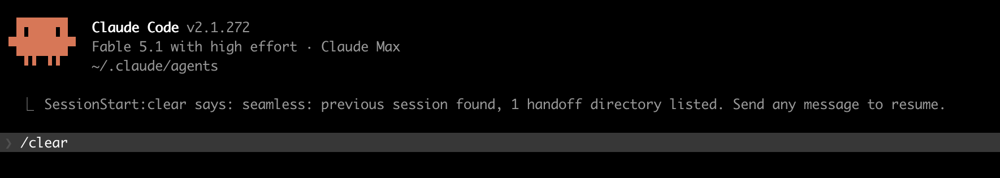

# seamless

`/clear` at any time. The next session carries on.

## Why, when there is `/compact`

Picture a real afternoon. You are deep in a task, the session has grown to several hundred
thousand tokens of context, and you step away for a couple of hours. When you come back, the
prompt cache for that conversation has expired. Now every option is bad:

- **Send the next message** and the whole context is re-read as uncached input, at full price,
  for every message from now on until the cache is warm again.
- **Run `/compact`** and it is worse than it looks. Compaction is a separate request that sends
  the same system prompt, the same tools and the *entire* history back to the model with a
  "summarise this" instruction. With a warm cache that is cheap: the prefix is read from cache
  and you pay mostly for generating the summary. With a cold cache there is nothing to read
  from, so the summarisation processes the full history as uncached input. `/compact` is at its
  most expensive exactly when you are most tempted to use it: on resuming an old session.
- **Run `/clear`** and it costs nothing. But the fresh session knows nothing and opens with
  "what were we working on?", and you retype the state from memory.

This plugin makes the third option the obvious one. Because a handoff document is kept alive
while you work, and because the fresh session gets the previous one's context injected before
your first message, `/clear` stops being a loss. Two things follow:

1. **Big sessions on a cold cache are no longer a trap.** Come back after a break, `/clear`,
   say "go on", and the work continues from the handoff. No compaction over cold tokens.
2. **You never have to wait for `/compact`.** You do not need the context window to fill up
   before starting fresh. Finished a block? Cache went cold over lunch? `/clear` and keep going.
   Each new session starts small, cheap and warm.

Whether the cache is warm right now is shown by `/usage` in recent versions of Claude Code
(the prompt-cache line for the main conversation); the cache lifetime depends on your plan and
settings.

## What it does

This plugin closes the gap from both sides:

- **`/seamless:save`** keeps a living handoff document in the project (`.claude/handoffs/`),
  created as soon as a task has a scope and updated after each finished block of work.
- **`/seamless:restore`** reads that document in a fresh session and continues from it.
- A **`SessionStart` hook** runs on `startup` and `clear` and hands the new session, before its
  first message: the startup directory, the previous session's last prompt, the handoff documents
  that exist for the project, the files edited most recently, and the standing rule to keep the
  handoff living. That is usually enough to resume without a question, even when no handoff was
  written, and it means nothing has to be added to `CLAUDE.md`. On `resume` and `compact` the
  same hook says one sentence: load the save skill before working on.
- A **`UserPromptSubmit` hook** covers the one case no session event can: the plugin was
  installed or reloaded while the session was already running. It costs one file check per
  prompt and speaks once, if ever (see "Sessions that predate the plugin" below).

Both skills are model-invocable: their descriptions and the hook's context tell Claude when to use
them, so in practice the handoff gets written and read without being asked for. After a restore
the hook also asks for one invocation of `/seamless:save` with nothing to write: a fresh session
has not read the skill, and the rules on where the document lives, how it is named and what goes
into it exist only there. Loading them once keeps later updates from being done by guesswork.

## Install

```
claude plugin marketplace add null-topology/claude-plugins
claude plugin install seamless@null-topology
```

### Requirements

- **A POSIX shell.** The hooks are plain `sh` scripts and run under dash, ash, bash and zsh, on
  macOS and Linux. Your login shell does not matter.
- **`jq`, recommended but optional.** It is the only tool the hooks use that is not part of a
  base system. Without it the hook still finds the previous session and the handoff documents,
  but it cannot read the transcript, so the previous session's last prompt, last message and
  edited files are missing. In that case the hook says so twice: one line to you after each
  startup or `/clear`, and one line to the agent asking it to tell you once at the start of its
  first reply that installing `jq` would complete the picture. `brew install jq` on macOS,
  `apt install jq` or your distribution's equivalent on Linux, or https://jqlang.github.io/jq/.

Claude Code has no install-time hook for plugins, so this check happens at the first session
start after installation rather than during `claude plugin install`.

### Update

```
claude plugin marketplace update null-topology
claude plugin update seamless@null-topology
```

Then `/reload-plugins` in a running session, or restart `claude`.

## What the hook injects

```
[seamless] This session replaces one the user just cleared. Context recovered:
Startup directory: /path/to/project
Previous session: 6cdafa28-… — the session that was just cleared (last activity 2026-09-15 17:22)
Last prompt of the previous session: add the lock to the sentry stack …
Last message of the previous session (its turn was completed):
Lock added and applied; the plan is clean. Left for you: decide whether the dormant stack …
Recently edited in the previous session (most recent first):
  /path/to/project/.claude/handoffs/2026-09-15-handoff-plugin.md
  /path/to/project/services/analytics/.infrastructure/locals.tf
Handoff documents (newest per directory, absolute paths):
  /path/to/project/.claude/handoffs/2026-09-15-handoff-plugin.md (modified 2026-09-15 17:18; 3 file(s) in this directory)
Now: before asking the user what they were working on, read the newest handoff with the seamless:restore skill. … Right after that, invoke the seamless:save skill once, even though there is nothing to write yet: that loads its rules …
Standing rule: the user relies on this plugin to /clear at any moment without losing the thread. Keep a living handoff document: … Never create or edit a handoff document in a session that has not invoked the seamless:save skill …
```

The previous session's last message is quoted only when that message actually ended a turn
(`stop_reason: end_turn`): then it is the agent's own closing summary of where things stand. If
the session was cleared while a turn was still running, an older summary would misdescribe the
state, so instead the hook lists the agent's last three actions before the cut, oldest first,
with times:

```
The previous session was cleared while a turn was still running, so there is no closing summary. Its last actions before that (oldest first):
  19:04 called Edit: /path/to/project/services/analytics/.infrastructure/locals.tf
  19:05 said: "Lock file updated, running the plan for the analytics stack now."
  19:05 called Bash: Run terraform plan for the analytics stack
```

Together with the handoff document this lets the new session work out what was done after the
handoff was last updated, and verify it rather than redo it.

You also see one line yourself right after `/clear` or startup, so it is obvious the mechanism
fired and the session is waiting for you:



A fresh session cannot start talking on its own: a turn begins with a message from you. Any word
will do; the injected context already tells the session to run `/seamless:restore` first.

### Seeing what the model received

The status line is for you; the model gets only the context block, and you normally do not see
it. Two ways to look at it:

- **Verbose mode.** Set `SEAMLESS_VERBOSE=1` in the environment Claude Code runs in (for example
  in the `env` block of `~/.claude/settings.json`) and the status line after each startup or
  `/clear` becomes the whole block, exactly as the model receives it. Off by default. Claude Code
  cuts a status line at 4000 characters, so a very long block loses its tail.
- **The transcript.** Every session records what its hooks injected. This prints the block the
  newest session of the current project received:

  ```
  jq -r 'select(.type=="attachment") | .attachment | select(.type=="hook_additional_context") | .content[]' \
    "$(ls -t ~/.claude/projects/$(pwd | sed 's#[/._]#-#g')/*.jsonl | head -1)"
  ```

- **Debug log.** Set `SEAMLESS_DEBUG=1` the same way and every hook run appends one line to
  `debug.log` in the plugin's data directory (`~/.claude/plugins/data/seamless-<marketplace>/`):
  time, event, source, session id, transcript path, and for the prompt hook whether the marker
  was present. Off by default; nothing is logged otherwise.

The hook reads only the current project's own transcript directory under `~/.claude/projects/`,
so context from another project never leaks into this one. A directory that has never had a
session gets no previous-session lines, only the standing rule.

The full block is built on `startup` and `clear` only. `resume` brings the context back by itself
and `compact` keeps the same session with a summary, so on those two the hook says one sentence:

```
[seamless] seamless is installed: before any further work, invoke the seamless:save skill once to load its rules, and keep the handoff living.
```

A summary may have dropped the rule, and a resumed session may predate the plugin; the sentence
costs a few dozen tokens per resume. `fork` inherits the parent's context and gets nothing.

### Sessions that predate the plugin

Install the plugin from inside a running session, `/reload-plugins`, and keep typing: no session
event fires, so the hooks above never speak. For that case the `SessionStart` hook leaves an
empty marker file named after the session id under the plugin's data directory whenever it has
spoken, and a `UserPromptSubmit` hook checks for that file on every prompt. Marker present: it
exits at once, one `stat` and no output. Marker absent: the session started before the plugin
was loaded, so the hook injects the sentence above with that prompt, shows you one status line
saying so, and leaves the marker. The transcript is never read, whatever its size. Markers older
than a month are deleted at the next session start.

How it knows which session was the previous one:

- **After `/clear`** a `SessionEnd` hook (reason `clear`) has just written a marker naming the
  transcript that was cleared, in the plugin's data directory. The `SessionStart` hook reads
  exactly that transcript and removes the marker. If the marker is missing or older than ten
  minutes it falls back to the newest transcript in the project other than the current one.
- **At `startup`** it takes the newest transcript in the project other than the current one, which
  is simply the last time Claude Code ran in this directory, and says how old it is.

## Handoff documents

Location: `<startup directory>/.claude/handoffs/`. A sub-project below the startup directory may
hold its own; when more than one directory has candidates, `restore` asks which one applies rather
than guessing.

Naming: `<YYYY-MM-DD>-<TICKET>-<slug>.md`, or `<YYYY-MM-DD>-<slug>.md` without a ticket. Date first
so `ls` sorts chronologically; the date is the creation date and the filename never changes on
update. Files in the older `handoff-<slug>-<date>.md` form are renamed one at a time when
`restore` opens them; nothing is mass-renamed.

Inside a sandboxed agent container (`AGENT_WORKING_DIR` set) the document goes to
`$AGENT_WORKING_DIR/workspace/handoffs/`, which is bind-mounted from the host and survives the
container.

Whether `.claude/handoffs/` is committed or ignored is your call per repository; the plugin does
not touch `.gitignore`.

## Known limits

- **Parallel sessions in one project.** After `/clear` the marker makes the choice exact. On
  `startup` "previous session" is the newest transcript other than the current one; if it was
  written less than a minute ago, the hook says it may belong to a session still running.
- **mtime is not trusted alone.** `git checkout`, `clone` and `rsync` reset it. The date in the
  filename is the reference; when the two disagree by more than a day the hook says so.
- **Only Write/Edit/NotebookEdit calls count as edits.** Files changed through shell commands are
  not listed.
- The previous session's last prompt is cut at 300 characters.

## Layout

```
plugins/seamless/
├── .claude-plugin/plugin.json
├── hooks/hooks.json                  SessionEnd "clear", SessionStart "startup|clear|resume|compact", UserPromptSubmit
├── scripts/
│   ├── session-end-mark.sh           marks the transcript that /clear just closed
│   ├── session-start-context.sh      builds the context for the new session; one sentence on resume/compact
│   └── user-prompt-onboard.sh        once per session that predates the plugin: the same sentence
└── skills/
    ├── save/SKILL.md                 /seamless:save
    └── restore/SKILL.md              /seamless:restore
```
